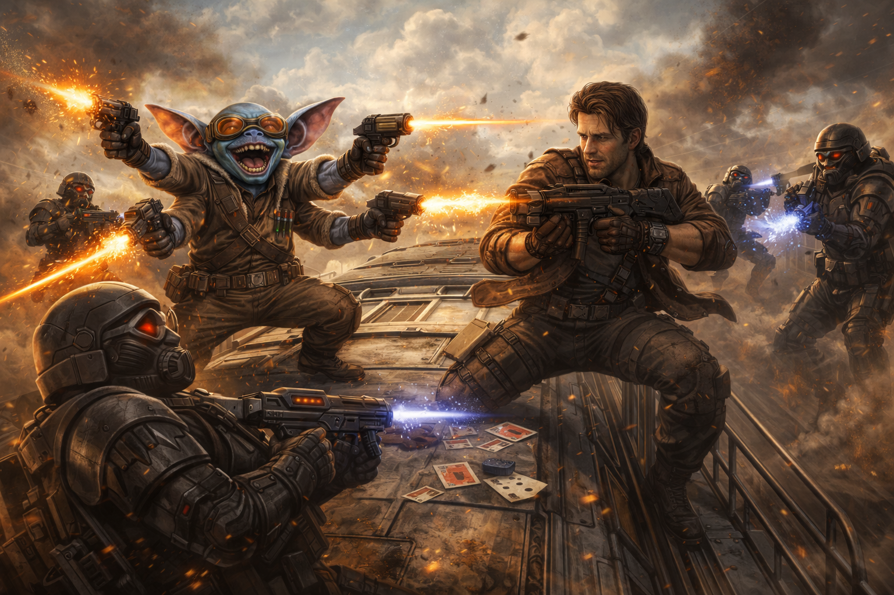
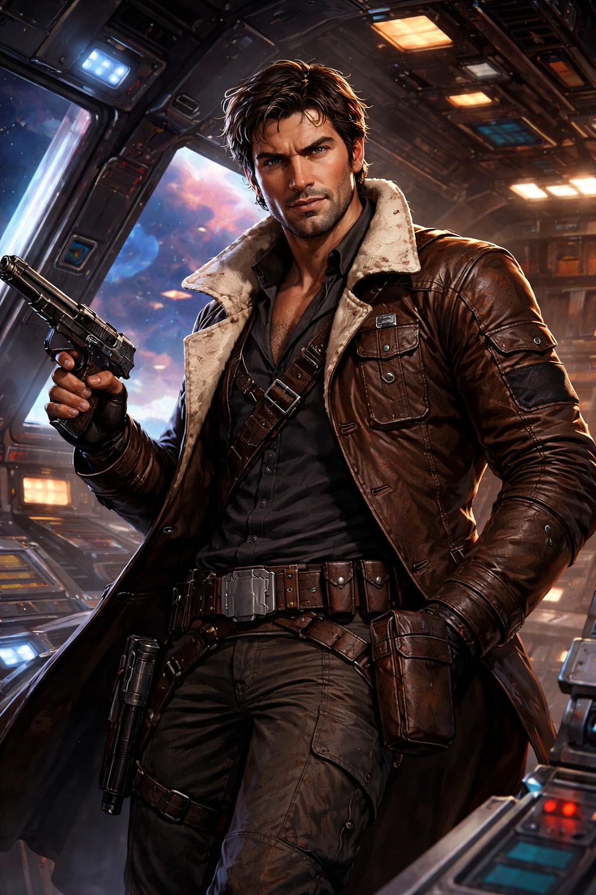
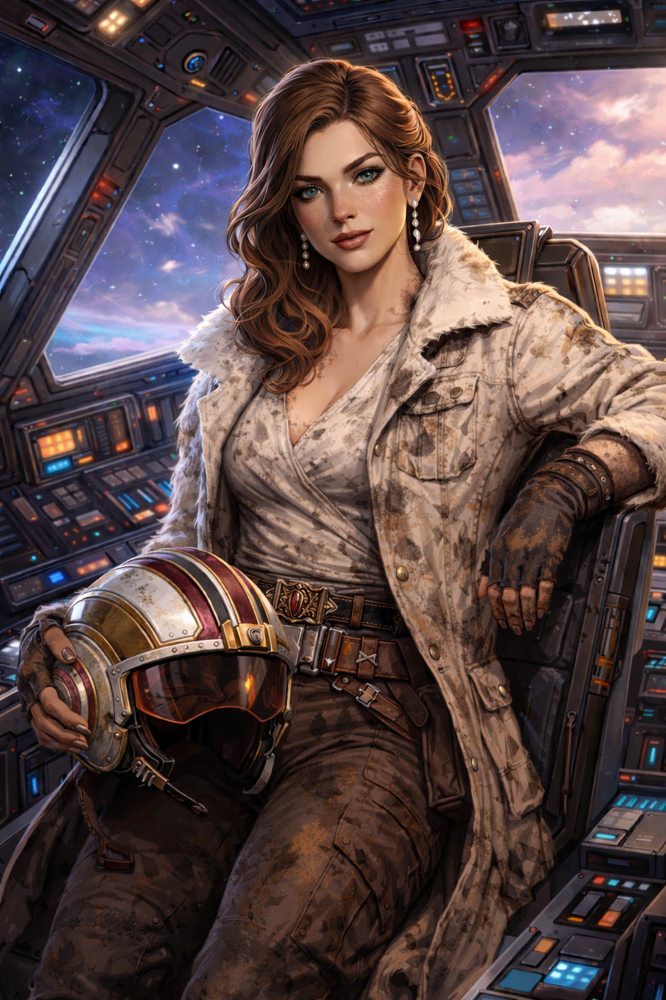
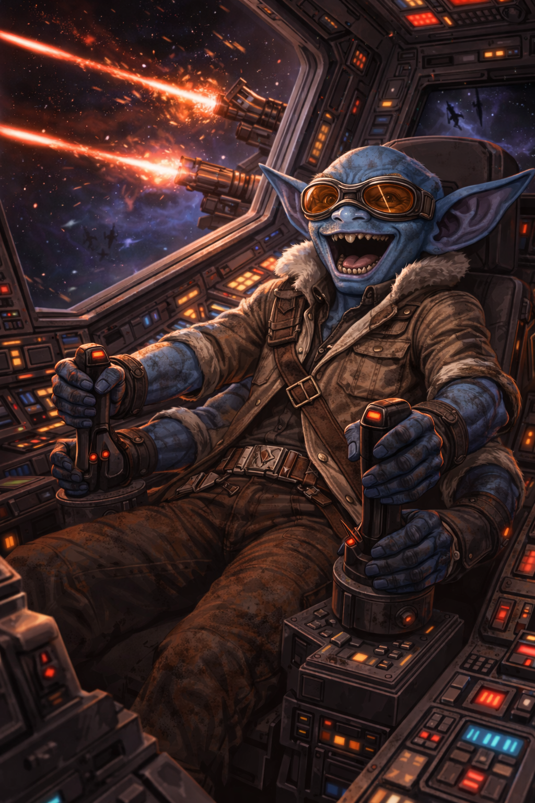
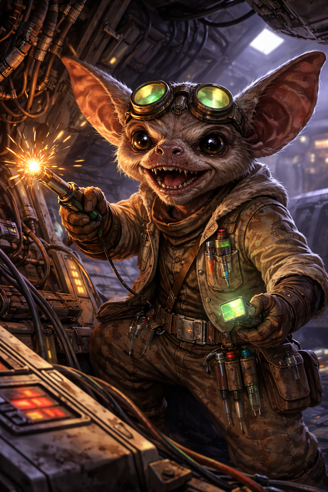

# Star Wars RPG — Tatooine Manhunt
### Modified Campaign Edition · West End Games D6

> *Ruthless bounty hunters and Rebel agents clash in a desperate manhunt for an elusive hero on the desert world of Tatooine.*

---

## Campaign Overview

| | |
|---|---|
| **System** | Star Wars RPG, West End Games (2nd Ed, D6) |
| **Module** | Tatooine Manhunt (WEG40005, 1988) |
| **Current Day** | Night of Day 2 / Dawn of Day 3 |
| **Hard Deadline** | Star Destroyer *Relentless* arrives end of Day 4 |

### The Mission
Find and protect **[Graff Raster](npcs/graff-raster.md)** — fallen Jedi, estranged uncle of Captain Bora and Indie — before [Jodo Kast](npcs/jodo-kast.md) captures him for the Empire. The Star Destroyer *[Relentless](https://starwars.fandom.com/wiki/Relentless)* is inbound. Time is running out.

### Key Campaign Modifications
- **Adar Tallon → Graff Raster** — renamed and reimagined as a fallen Jedi
- **Captain Bora & Indie are siblings** — Graff Raster is their estranged uncle *(unrevealed to players)*
- **Henry** — adolescent Wookiee, Gune's ward, recently arrested
- **New Gamorrean PC** — former Jabba guard, introduced in the Jailbreak episode

---

## Player Characters

| Portrait | Character | Species | Role |
|---|---|---|---|
|  | **[Captain Bora](pcs/captain-bora.md)** | [Human](https://starwars.fandom.com/wiki/Human/Legends) | Roguish captain & leader. Indie's brother. Graff Raster's nephew. |
|  | **[Indie](pcs/indie.md)** | [Human](https://starwars.fandom.com/wiki/Human/Legends) | Pilot & navigator. Bora's sister. Graff Raster's niece. |
|  | **[Eck](pcs/eck.md)** | Blue-skinned alien | Combat specialist |
|  | **[Gune](pcs/gune.md)** | Small alien | Mechanic & tech specialist. Henry's guardian. |
| *(portrait pending)* | **[Gamorrean PC](pcs/gamorrean.md)** | [Gamorrean](https://starwars.fandom.com/wiki/Gamorrean/Legends) | Former Jabba guard |
|  | **[Henry](pcs/henry.md)** | [Wookiee](https://starwars.fandom.com/wiki/Wookiee/Legends) | Adolescent ward of Gune |

---

## Session Notes

| Session | Title | Day | Status |
|---|---|---|---|
| [The Jailbreak](sessions/jailbreak.md) | Break Henry out of Mos Eisley jail | Night, Day 2 | **← NEXT** |
| [Episode 5 — Exploring the Wastes](sessions/episode-05-exploring-the-wastes.md) | Into the desert with Old Arno | Day 3 | Upcoming |

---

## NPC Roster

### Allied NPCs
| NPC | Role |
|---|---|
| [Graff Raster](npcs/graff-raster.md) | The fallen Jedi — the mission objective |
| [Kay Raster](npcs/kay-raster.md) | Graff's wife |
| [Vytor Shrike](npcs/vytor-shrike.md) | Graff's first officer, insectoid merc |
| [Jungen](npcs/jungen.md) | Graff's outlaw bodyguard, reptilian bruiser |
| [Old Arno](npcs/old-arno.md) | Desert scout, last of the oldsters |
| [Dryon](npcs/dryon.md) | High Priest of the Dim-U at the Oasis |

### Enemy NPCs
| NPC | Role |
|---|---|
| [Jodo Kast](npcs/jodo-kast.md) | Primary antagonist bounty hunter |
| [Quist](npcs/quist.md) | ⚠ Traitor in Graff's camp |
| [Zardra](npcs/zardra.md) | Deadly female bounty hunter with Kast |
| [Puggles Trodd](npcs/puggles-trodd.md) | Kast's explosives-obsessed sidekick |
| [IG-72](npcs/ig-72.md) | Rogue assassin droid hunting Raster |
| [Labria](npcs/labria.md) | Drunken informant working for Kast |

### Jabba's People
| NPC | Role |
|---|---|
| [Akkik](npcs/akkik.md) | Jawa enforcer — got the Gamorrean PC fired |
| [Gorrt](npcs/gorrt.md) | Gamorrean muscle, currently in the medical bay |
| [Prefect Orun Depp](npcs/prefect-depp.md) | Imperial prefect of Mos Eisley, sole jail keyholder |

---

## Ships & Vehicles

| Ship | Owner | Role |
|---|---|---|
| [*Alabak's Gold*](ships/alabaks-gold.md) | The Party | Mon Calamari freighter, party ship |
| [Z-95 Headhunters](ships/z-95-headhunters.md) | Graff Raster | Modified fighters at Tusken Fort |
| [TIE Interceptors](ships/tie-interceptors.md) | Galactic Empire | Final space battle, Episode 8 |

---

## Adventure Timeline

| Day | Events |
|---|---|
| **Day 1** | [Kwenn Space Station](https://starwars.fandom.com/wiki/Kwenn_Space_Station) — Dana killed, escape |
| **Day 2** | Arrive [Tatooine](https://starwars.fandom.com/wiki/Tatooine/Legends) · [Mos Eisley](https://starwars.fandom.com/wiki/Mos_Eisley/Legends) · Cantina ambush · Henry arrested |
| **Day 3** | ← **YOU ARE HERE** · Jailbreak · Into the Wastes · [Krayt Dragons](https://starwars.fandom.com/wiki/Krayt_dragon/Legends) · The Oasis |
| **Day 4** | Lank's Farm · [Tusken Raiders](https://starwars.fandom.com/wiki/Tusken_Raider/Legends) · [Tusken Fort](https://starwars.fandom.com/wiki/Tusken_Fort) · **Meet Graff Raster** · Betrayal |
| **Day 4 night** | Race to Mos Eisley · Stormtroopers · [IG-72](npcs/ig-72.md) |
| **Day 5 dawn** | *Relentless* arrives · **Escape from Tatooine** · Space battle |

---

*Based on WEG40005 Tatooine Manhunt (1988) · All lore links default to [Legends continuity](https://starwars.fandom.com/wiki/Main_Page)*
