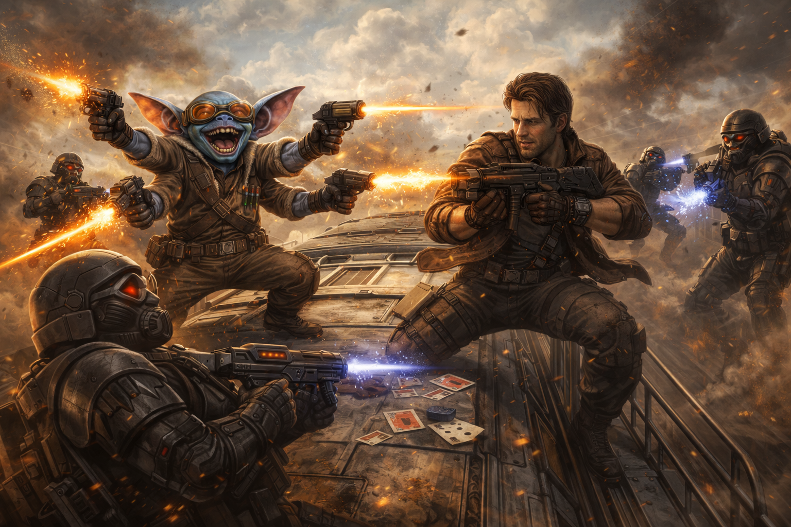
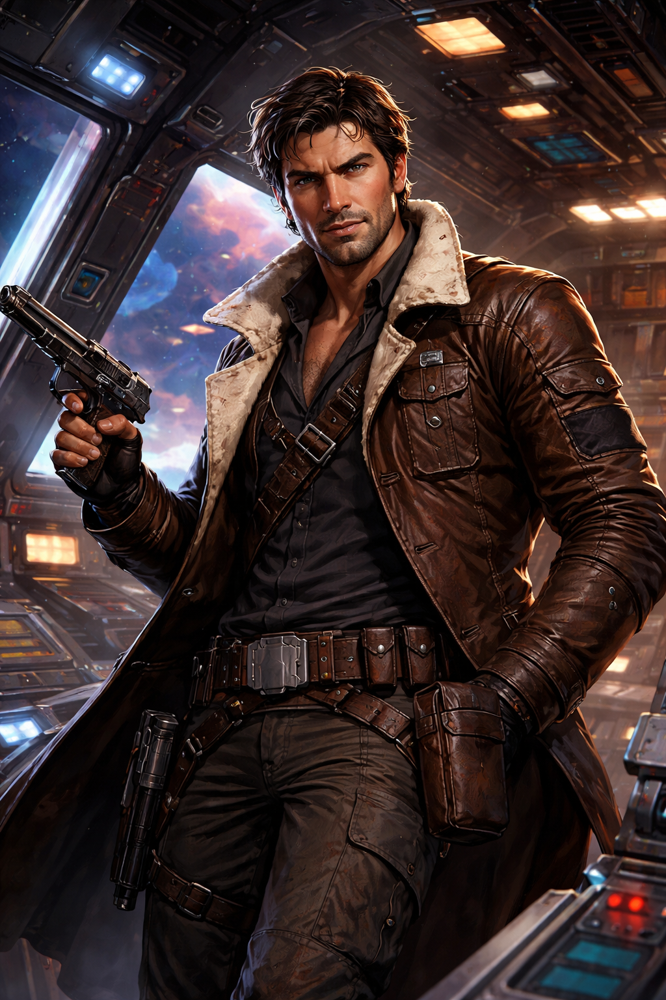
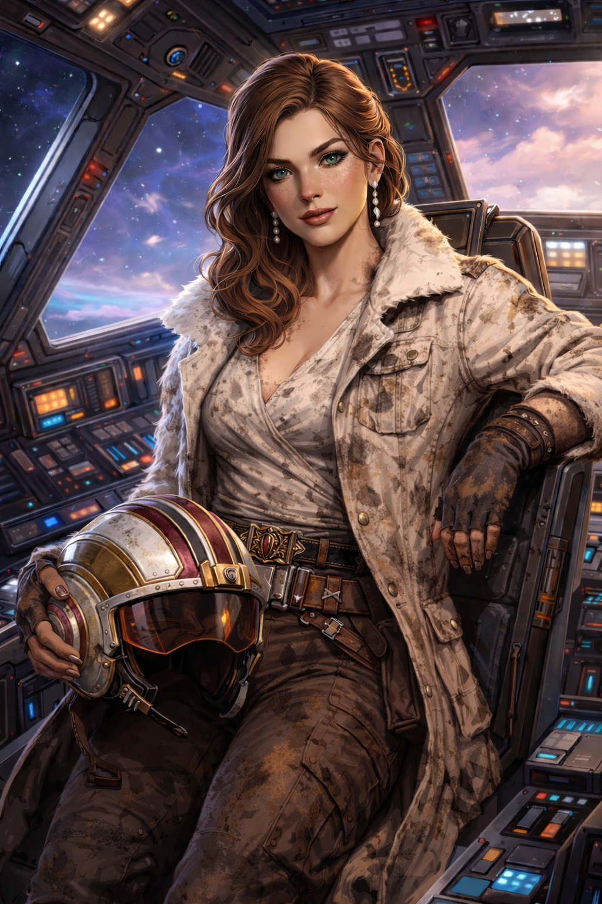
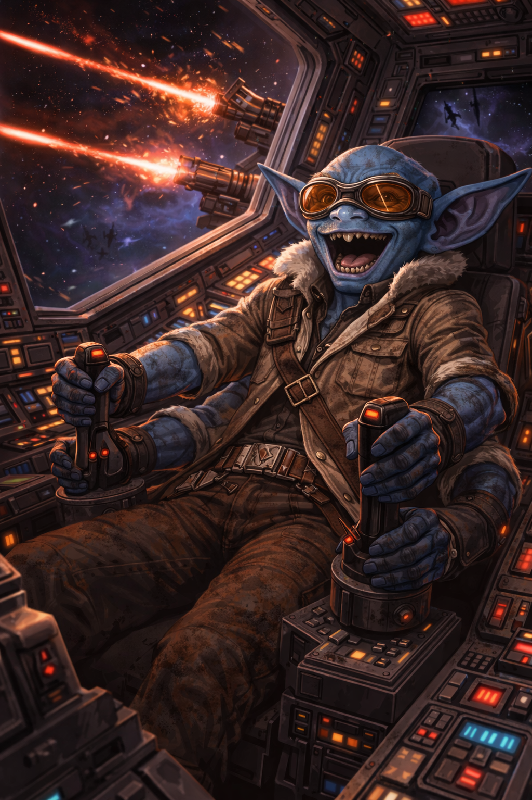
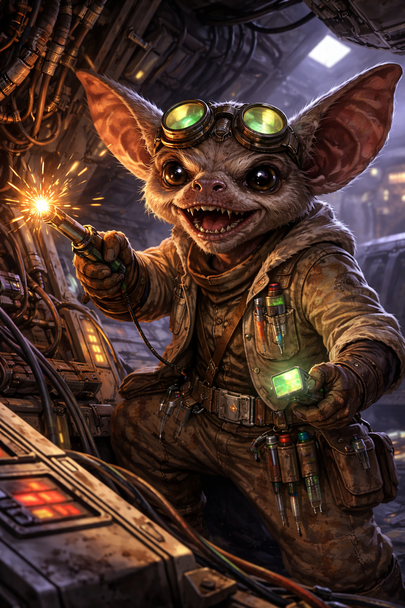

# Star Wars RPG — Tatooine Manhunt
### Modified Campaign Edition · West End Games D6

> *Ruthless bounty hunters and Rebel agents clash in a desperate manhunt for an elusive hero on the desert world of Tatooine.*

---

## Campaign Overview

| | |
|---|---|
| **System** | Star Wars RPG, West End Games (2nd Ed, D6) |
| **Module** | Tatooine Manhunt (WEG40005, 1988) |
| **Current Day** | Night of Day 2 / Dawn of Day 3 |
| **Hard Deadline** | Star Destroyer *Relentless* arrives end of Day 4 |

### The Mission
Find and protect **[Graff Raster](pcs/graff-raster.md)** — fallen Jedi, estranged uncle of Captain Bora and Indie — before [Jodo Kast](npcs/jodo-kast.md) captures him for the Empire. The Star Destroyer *[Relentless](https://starwars.fandom.com/wiki/Relentless)* is inbound. Time is running out.

### Key Campaign Modifications
- **Adar Tallon → Graff Raster** — renamed and reimagined as a fallen Jedi
- **Captain Bora & Indie are siblings** — Graff Raster is their estranged uncle *(unrevealed to their characters)*
- **Graff Raster is now a player character** — formerly run as an NPC/mission objective
- **Henry** — adolescent Wookiee, Gune's ward, recently arrested
- **Torbek** — former Jabba collector, marked for death over missing protection money, introduced in the Jailbreak episode

---

## Player Characters

| Portrait                                 | Character                               | Species                                                           | Role                                                              |
| ---------------------------------------- | --------------------------------------- | ----------------------------------------------------------------- | ----------------------------------------------------------------- |
|  | **[Captain Bora](pcs/captain-bora.md)** | [Human](https://starwars.fandom.com/wiki/Human/Legends)           | Roguish captain & leader. Indie's brother. Graff Raster's nephew. |
|                | **[Indie](pcs/indie.md)**               | [Human](https://starwars.fandom.com/wiki/Human/Legends)           | Pilot & navigator. Bora's sister. Graff Raster's niece.           |
|                    | **[Eck](pcs/eck.md)**                   | [Ardennian](https://starwars.fandom.com/wiki/Ardennian)           | Combat specialist                                                 |
|                  | **[Gune](pcs/gune.md)**                 | [Chadra-Fan](https://starwars.fandom.com/wiki/Chadra-Fan/Legends) | Mechanic & tech specialist. Henry's guardian.                     |
| *(portrait pending)*                     | **[Torbek](pcs/torbek.md)**             | [Gamorrean](https://starwars.fandom.com/wiki/Gamorrean/Legends)   | Former Jabba collector, marked for death                          |
|                | **[Henry](pcs/henry.md)**               | [Wookiee](https://starwars.fandom.com/wiki/Wookiee/Legends)       | Adolescent ward of Gune                                           |
| *(portrait pending)*                     | **[Graff Raster](pcs/graff-raster.md)** | [Human](https://starwars.fandom.com/wiki/Human/Legends)           | Fallen Jedi Knight, ex-Separatist privateer. Bora & Indie's uncle *(unrevealed in-fiction)*. |

---

## Session Notes

| Session | Title | Day | Status |
|---|---|---|---|
| [The Jailbreak](sessions/jailbreak.md) | Break Henry out of Mos Eisley jail | Night, Day 2 | **← NEXT** |
| [Season 2 Episode 2 — Exploring the Wastes](sessions/exploring-the-wastes.md) | Into the desert with Old Arno | Day 3 | Upcoming |

---

## NPC Roster

### Allied NPCs
| NPC | Role |
|---|---|
| [Vytor Shrike](npcs/vytor-shrike.md) | Graff's first officer, insectoid merc |
| [Jungen](npcs/jungen.md) | Graff's outlaw bodyguard, reptilian bruiser |
| [Old Arno](npcs/old-arno.md) | Desert scout, last of the oldsters |
| [Dryon](npcs/dryon.md) | High Priest of the Dim-U at the Oasis |

### Enemy NPCs
| NPC | Role |
|---|---|
| [Jodo Kast](npcs/jodo-kast.md) | Primary antagonist bounty hunter |
| [Quist](npcs/quist.md) | ⚠ Traitor in Graff's camp |
| [Zardra](npcs/zardra.md) | Deadly female bounty hunter with Kast |
| [Puggles Trodd](npcs/puggles-trodd.md) | Kast's explosives-obsessed sidekick |
| [IG-72](npcs/ig-72.md) | Rogue assassin droid hunting Raster |
| [Labria](npcs/labria.md) | Drunken informant working for Kast |

### Jabba's People
| NPC | Role |
|---|---|
| [Akkik](npcs/akkik.md) | Jawa enforcer — Jabba's eyes in Mos Eisley |
| [Gorrt](npcs/gorrt.md) | Gamorrean muscle, currently in the medical bay |
| [Prefect Orun Depp](npcs/prefect-depp.md) | Imperial prefect of Mos Eisley, sole jail keyholder |

---

## Ships & Vehicles

| Ship | Owner | Role |
|---|---|---|
| [*Centennial Duck*](ships/centennial-duck.md) | The Party | Corellian VTX-100 freighter, party ship |
| [Z-95 Headhunters](ships/z-95-headhunters.md) | [Graff Raster](pcs/graff-raster.md) | Modified fighters at Tusken Fort |
| [TIE Interceptors](ships/tie-interceptors.md) | Galactic Empire | Final space battle, Episode 8 |

---

## Adventure Timeline

| Day | Events |
|---|---|
| **Day 1** | [Kwenn Space Station](https://starwars.fandom.com/wiki/Kwenn_Space_Station) — Dana killed, escape |
| **Day 2** | Arrive [Tatooine](https://starwars.fandom.com/wiki/Tatooine/Legends) · [Mos Eisley](https://starwars.fandom.com/wiki/Mos_Eisley/Legends) · Cantina ambush · Henry arrested |
| **Day 3** | ← **YOU ARE HERE** · Jailbreak · Into the Wastes · [Krayt Dragons](https://starwars.fandom.com/wiki/Krayt_dragon/Legends) · The Oasis |
| **Day 4** | Lank's Farm · [Tusken Raiders](https://starwars.fandom.com/wiki/Tusken_Raider/Legends) · [Tusken Fort](https://starwars.fandom.com/wiki/Tusken_Fort) · **Meet Graff Raster** · Betrayal |
| **Day 4 night** | Race to Mos Eisley · Stormtroopers · [IG-72](npcs/ig-72.md) |
| **Day 5 dawn** | *Relentless* arrives · **Escape from Tatooine** · Space battle |

---

## Season 3 — The Minos Cluster
### Modified Campaign Edition · Based on WEG40095 *Galaxy Guide 6: Tramp Freighters*

> *Broke, burned, and five days from anywhere anyone's heard of them — the crew runs cargo at the edge of the map while the Rebellion starts creeping back into their lives.*

Picks up immediately after **Episode 8 — Escape from Tatooine**. Not yet started.

### Season Overview

| | |
|---|---|
| **System** | Star Wars RPG, West End Games (2nd Ed, D6) |
| **Setting** | Minos Cluster (WEG40095, *Galaxy Guide 6: Tramp Freighters*, Ch. 9–13) |
| **Status** | Not yet started — begins after Episode 8 |
| **Location** | The Minos Cluster, ~5 days' hyperspace from the nearest inhabited system |

### The Setup
After the *Relentless* forces them out of the Tatooine system, the crew is battered, broke, and burned — their faces and the *Centennial Duck*'s transponder are now known to the Empire. **[Vytor Shrike](npcs/vytor-shrike.md)** knows a way out: the Minos Cluster, a backwater at the edge of charted space where the Empire barely bothers to patrol and "no questions asked" freight work pays well precisely because nobody out there is asking questions. First stop: **Travnin**, the Cluster's sector capital — a place to disappear, get the *Duck* properly repaired, and start earning again.

### Key Campaign Modifications
- **Arrival is organic, not accidental.** The crew chooses to go — a lead from Shrike's privateer days, not an emergency jump or a handler's order.
- **The tramp-freighter sandbox comes first.** Cargo runs, customs friction, and debt before any Rebel entanglement — an intentional change of pace from the tight Tatooine clock.
- **Tatooine heat carries over.** [Jodo Kast](npcs/jodo-kast.md), Captain Parlan, and Imperial Security Bureau assets in the Cluster remain live threats and can resurface.
- **The season escalates in phases**, adapted from the book's own structure: freighter sandbox → Rebel-linked cargo jobs → the rescue of imprisoned Rebel leader Drun Cairnwick → a cluster-wide revolt against the Star Destroyer *The Chariot*.

### Season Notes
| Session | Title | Status |
|---|---|---|
| [Season 3, Episode 1 — The Long Way Out](sessions/the-long-way-out.md) | Transit to Travnin, customs, first contact with the Cluster | **← NEXT** |

### New NPCs

| NPC | Role |
|---|---|
| [Babel Torsch](npcs/babel-torsch.md) | Incorruptible Imperial Customs officer, Travnin |
| [Yerkys ne Dago](npcs/yerkys-ne-dago.md) | Twi'lek crime boss and loan shark running the Cluster's black market |

---

*Based on WEG40005 Tatooine Manhunt (1988) and WEG40095 Galaxy Guide 6: Tramp Freighters (1994) · All lore links default to [Legends continuity](https://starwars.fandom.com/wiki/Main_Page)*
