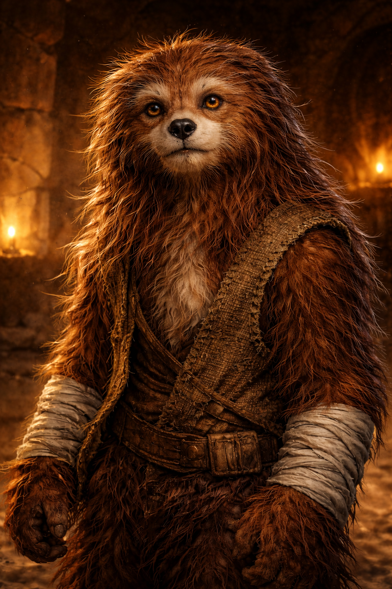

# Henry
### NPC Companion · Adolescent [Wookiee](https://starwars.fandom.com/wiki/Wookiee/Legends) · Gune's Ward

← [Back to Campaign](../README.md)

---

## Overview

| | |
|---|---|
| **Species** | [Wookiee](https://starwars.fandom.com/wiki/Wookiee/Legends) (adolescent) |
| **Role** | Party companion, Gune's ward |
| **Current status** | ⚠ In Mos Eisley jail — [see Jailbreak session](../sessions/jailbreak.md) |
| **Guardian** | [Gune](gune.md) |

## Background

Rescued from slavery by [Gune](gune.md). Travels with the party. Not fully grown — adolescent by Wookiee standards — but already formidable. Trusts Gune completely. Is still learning how to live outside captivity.

During the Cantina Ambush (Episode 4), he witnessed something that triggered a Wookiee rage. He ran into the street and was arrested by the [Mos Eisley](https://starwars.fandom.com/wiki/Mos_Eisley/Legends) militia.

## Stats

| Attribute | Value | Skills |
|---|---|---|
| DEX | 3D | Brawling Parry 4D+1 |
| KNO | 2D | Survival 3D |
| MEC | 2D | — |
| PER | 2D+1 | Search 3D |
| STR | 4D | Brawling 5D+2 |
| TEC | 2D+1 | Repair 3D |

## Wookiee Rage

When Henry witnesses cruelty toward the helpless or is badly hurt, the GM may trigger rage.

- All STR and brawling +2D for 3 rounds
- Cannot use ranged weapons during rage
- Exhausted afterward: –1D all rolls for 10 minutes
- **[Gune](gune.md)'s voice** can calm him mid-rage: opposed *command* roll vs Henry's current STR

## Cell Bond

Henry spent the night in jail with the new [Gamorrean PC](gamorrean.md). Neither attacked the other. By arrival of the PCs, they've been quietly working the cell bars together for hours. The Gamorrean's honor code, Henry's trust — an unlikely alliance formed in a stone cell.

---

*← [Player Characters](../README.md#player-characters)*
